<h3><code>ritik@github ~ $ ./contributions.sh</code></h3>

<picture>
  <source media="(prefers-color-scheme: dark)" srcset="./assets/heatmap-dark.svg">
  
</picture>

 
 

<h3><code>ritik@github ~ $ whoami</code></h3>

<picture>
  <source media="(prefers-color-scheme: dark)" srcset="./assets/portrait-dark.svg">
  
</picture>
<picture>
  <source media="(prefers-color-scheme: dark)" srcset="./assets/stats-dark.svg">
  
</picture>

 
 

<h3><code>ritik@github ~ $ cat about.md</code></h3>

<b>Ritik Srivastava</b> · Full Stack Developer at <b>Adeptmind</b> · Bengaluru, India 
Full Stack Engineer specializing in scalable web applications, AI powered systems, and high performance infrastructure with TypeScript, React, Node, Python, Go. 
Previously at Plivo, Societe Generale Global Solution Centre and Postman.

 

      
      
    

 

<h3><code>ritik@github ~ $ ./links.sh</code></h3>

       

